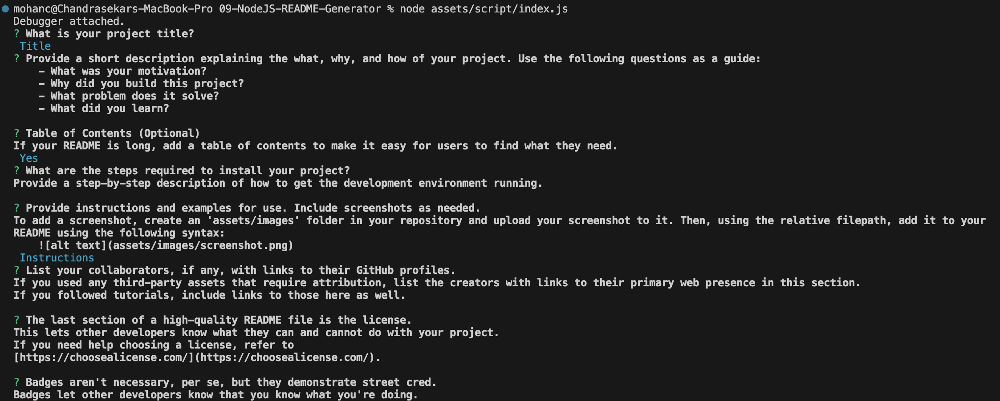

# NodeJS README Generator

[](http://choosealicense.com/licenses/mit/)

## Description
Application to create README for a project 

## Table of Contents
 - [Installation](#installation)
 - [Usage](#usage)
 - [License](#license)

## Installation
Clone the github repo as shown below, <br/> ``` git clone git@github.com:chandraucb/09-NodeJS-README-Generator.git ``` <br/> Run node package install <br/> ``` npm install ```

## Usage
To run this application execute below command and follow the prompts <br/> ```node asset\scripts\index.js ``` <br/> <br/> README and LICENSE/UNLICENSE file will be created under output folder <br/> Add these files under root folder in your project repo <br/>  


## License
Copyright (c) 2023 Chandrasekar Mohan
Licensed under the MIT License


A short and simple permissive license with conditions only requiring preservation of copyright and license notices. Licensed works, modifications, and larger works may be distributed under different terms and without source code.
More information about this license can be found at below link,
http://choosealicense.com/licenses/mit/


## Questions
Name : Chandrasekar Mohan
Git profile : https://github.com/chandraucb
Contact email : xyz@abc.com
Reach me through email with additional questions

